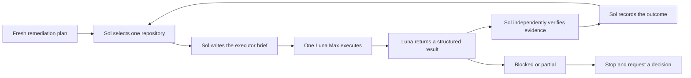

# Sequential remediation handoff

This document is the coordination contract for running Pronto remediation one
repository at a time. It is designed to be handed to one Sol orchestrator
thread. Sol plans the next bounded slice, dispatches one Luna Max executor,
verifies the returned evidence, and only then advances the queue.

The persisted `pronto-remediation/v3` projection remains the source of truth
for the queue, actions, evidence, and closure state. This document records
coordination state and decisions; it must not become a second copy of the
queue.

## Operating invariant

There is never more than one active Luna Max executor for this run.

The only valid transition is:



Sol must not start the next Luna thread until the current result is either:

- `verified`: acceptance criteria and required evidence are present; or
- `blocked`: the run is explicitly stopped and the user has supplied the next
  decision.

An executor result that is merely reported, uncommitted, stale, or unverified
does not authorize queue advancement.

## Sources of truth

- **Current queue:** the scoped `pronto remediation [repository] --json`
  projection. Use the documented invocation and doctor/freshness gate in
  [the agent command contract](../.agents/context/commands.md).
- **Fleet order:** the generated
  [`repository-remediation-order.md`](./repository-remediation-order.md).
  Refresh/export it before a new run; do not hand-edit its ranked facts.
- **Repository intent:** the repository's `.pronto/remediation-goal.json`
  when present and valid. Missing or invalid intent stays visible as an
  unresolved confirmation gap.
- **Live repository truth:** the selected repository's current branch,
  worktrees, dirty state, commit, provider evidence, and quality commands.
- **Coordination truth:** the active dispatch and result ledger in this
  document. Coordination entries never override evidence or closure state.

## Authority and safety boundaries

The handoff does not grant authority that the user has not granted elsewhere.

- Sol may inspect, plan, dispatch, verify, and update this coordination record.
- Luna Max may modify only the selected repository and only the scope named in
  its brief.
- Git commit, push, merge, rebase, branch deletion, provider mutation,
  publication, release, credential access, and application installation must
  be explicitly authorized in the brief or by the user. The default is **not
  authorized**.
- Dirty, unpublished, active, or ambiguous work is preserved and reported;
  it is never silently folded into remediation.
- No agent copies secrets, raw provider caches, local databases, or unrelated
  repository content into this document or a brief.
- A failed prerequisite, unavailable provider, stale evidence, ownership
  ambiguity, or acceptance failure stops the sequence. It is not converted
  into success by inference.

## Run header

Sol fills this block from a fresh plan before dispatching the first executor.
Keep one active dispatch at a time.

```yaml
run_id: "<human or generated run id>"
mode: sequential
orchestrator: Sol
executor_model: Luna Max
plan_source:
  command: "pronto remediation --json"
  generated_at: "<fresh UTC timestamp>"
  remediation_run_id: "<pronto-remediation/v3 id>"
  source_refresh_id: "<refresh id or null>"
active_dispatch:
  sequence: 0
  repository_name: null
  repository_path: null
  repository_id: null
  plan_id: null
  status: ready
next_repository: null
stop_reason: null
```

Allowed `active_dispatch.status` values are `ready`, `briefed`,
`executing`, `result_received`, `verifying`, `verified`, `partial`, and
`blocked`. `next_repository` remains empty while an executor is active.

## Sol orchestrator procedure

1. Read this document and the current Pronto remediation projection. Confirm
   the doctor/freshness gate for the selected scope before using its evidence.
2. Choose the highest-ranked repository that has not reached `verified` in this
   run. Preserve the plan's ranking and earliest unresolved domain unless a
   fresh evidence change makes the selection invalid.
3. Inspect the repository's live ownership boundary and identify the smallest
   useful remediation slice. Separate observed facts, inferred gaps, and
   unknowns.
4. Fill the dispatch brief below. State exact action IDs, files or surfaces,
   acceptance criteria, required commands, and mutation authority.
5. Start exactly one Luna Max executor with that brief. Set the active status
   to `executing`; do not start another executor while it is active.
6. Receive the structured result. If it is missing, ambiguous, or outside the
   brief, set `partial` or `blocked` and stop.
7. Independently verify the claimed result against the repository and Pronto:
   rerun the relevant quality commands, inspect the exact commit and dirty
   state, and refresh/import only the authorized evidence scope.
8. Set the dispatch to `verified` only when the acceptance criteria and
   evidence are current. Record remaining actions rather than erasing them.
9. Refresh the queue projection or export when ranking can change, record the
   next repository, clear `active_dispatch`, and dispatch the next Luna Max.

If any step fails, leave the last known state and exact blocker in the ledger;
do not skip to the next repository.

## Dispatch brief for Luna Max

Sol sends one instance of this brief per executor. The brief is the executor's
scope boundary, not a request to solve the entire repository.

```text
LUNA MAX REMEDIATION BRIEF

Run: <run_id>
Sequence: <number>
Repository: <name>
Absolute path: <path>
Repository id: <id>
Pronto plan id: <plan id>
Plan generated at: <UTC timestamp>
Source commit observed: <commit or unknown>

Goal and closure predicate:
<What must be true for this repository's current goal, using the plan's
applicable gates and evidence window.>

Observed gaps (evidence-backed):
- <action id>: <observed gap and evidence reference>

In scope for this executor:
- <one bounded implementation or evidence slice>

Out of scope:
- <later phases, unrelated dirty work, provider/publication work, or anything
  not explicitly authorized>

Acceptance criteria:
- <specific behavior or evidence that Sol can verify>

Required validation:
- <repository-documented focused command>
- <quality/typecheck/test/build command when applicable>

Mutation authority:
- Repository edits: <authorized | not authorized>
- Commit: <authorized | not authorized>
- Push/provider/publication/release: <authorized | not authorized>
- Credentials or persistent access: <authorized | not authorized>

Return the structured result below. Do not dispatch another executor.
```

## Luna Max result contract

Luna returns this result to Sol before the thread ends. A natural-language
summary may accompany it, but these fields must remain explicit.

```text
LUNA MAX REMEDIATION RESULT

Run: <run_id>
Sequence: <number>
Repository: <name> (<absolute path>)
Status: <complete | partial | blocked | no_action>

Before:
- Source commit: <commit>
- Branch/worktree state: <clean/dirty/ahead/behind/active operation>
- Relevant plan/action ids: <ids>

Work performed:
- <file or evidence change and why>

After:
- Source commit: <commit or unchanged>
- Branch/worktree state: <observed state>
- Git/provider/publication mutations: <none or exact authorized mutation>

Validation:
- <command>: <pass/fail/blocked and concise output>
- <fresh evidence path or provider receipt, if applicable>

Acceptance:
- Met: <criteria>
- Not met: <criteria and reason>

Remaining plan actions:
- <action id and current disposition>

Blockers and ownership:
- <exact blocker, required human decision, or none>

Recommended orchestrator disposition:
- <verify and advance | replan this repository | stop for user decision>
```

## Verification and ledger entry

Sol appends one compact entry after verification. The entry records provenance,
not a second action inventory.

```yaml
- sequence: <number>
  repository: <name>
  repository_path: <absolute path>
  plan_id: <id>
  dispatched_at: <UTC timestamp>
  result_received_at: <UTC timestamp>
  result_status: <complete | partial | blocked | no_action>
  verified_status: <verified | partial | blocked>
  before_commit: <commit>
  after_commit: <commit or unchanged>
  evidence_refs:
    - <path, command receipt, or provider reference>
  remaining_action_ids:
    - <id>
  blocker: <null or exact blocker>
  next_step: <next repository or stop>
```

## Stop and resume rules

Stop the run and leave `stop_reason` populated when:

- the selected repository is dirty or active and ownership is unclear;
- the doctor or route gate is blocked, stale, or unauthenticated;
- the plan changes materially while Luna is executing;
- a required command fails and has no bounded in-scope repair;
- Luna reports a mutation outside the brief or cannot return provenance;
- verification cannot establish the claimed result; or
- user authority is required for Git, provider, publication, release,
  credentials, privacy, or persistent access.

To resume, a Sol thread reads the last ledger entry, rechecks live repository
and Pronto evidence, and either continues the same repository with a revised
brief or selects the next repository only when the prior entry is `verified`.
Never infer completion from the presence of a commit, a clean worktree, or a
green command alone; closure requires the plan's evidence-backed predicate.

## Sol activation prompt

Use this short prompt when handing the document to the orchestrator:

```text
You are the sole Sol remediation orchestrator. Read
docs/remediation-sequential-handoff.md, then read the fresh scoped
pronto-remediation/v3 plan. Work strictly sequentially: select one repository,
write one Luna Max brief, wait for its structured result, independently verify
it, record the ledger entry, and only then start the next Luna Max thread.
Preserve dirty or ambiguous work, keep all mutations within explicit authority,
and stop for any blocker or missing evidence. Do not copy the queue into the
handoff; reference the current Pronto projection instead.
```
