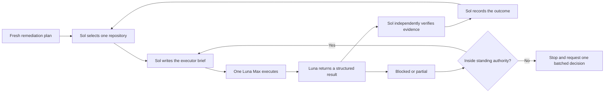

# Sequential remediation handoff

This document is the coordination contract for running Pronto remediation one
repository at a time. It is designed to be handed to one Sol orchestrator
thread. Sol plans the next bounded slice, dispatches one Luna Max executor,
verifies the returned evidence, and only then advances the queue.

The persisted `pronto-remediation/v3` projection remains the source of truth
for the queue, actions, evidence, and closure state. This document records
coordination state and decisions; it must not become a second copy of the
queue.

## Operating invariant

There is never more than one active Luna Max executor for this run.

The only valid transition is:



Sol must not start the next Luna thread until the current result is either:

- `verified`: acceptance criteria and required evidence are present; or
- `blocked`: the run crossed a hard boundary below and the user has supplied
  one batched decision.

An executor result that is merely reported, uncommitted, stale, or unverified
does not authorize queue advancement.

## Checkpoint invariant

The provider-neutral rule is: work owned by the active executor must be locally
checkpointed before it is handed off or marked `verified`. A checkpoint is a
local commit on the isolated working branch that contains the intended scoped
changes. It is not a fleet-wide auto-commit, a nightly blind sweep, or a stash
that hides ownership.

Pronto bounds this rule at the remediation boundary. Before Sol advances a
repository, run:

```sh
pronto remediation handoff-check <repository> --json
```

The command performs a live, read-only Git check. `ready: false` is a hard
stop. A dirty workspace requires ownership review and a local checkpoint
commit; owner-ambiguous or unrelated dirty work remains preserved and keeps
the handoff blocked. After committing, run the scoped `pronto refresh`, then
repeat the handoff check so the persisted snapshot and live Git state agree.
Pronto also repeats this gate when `remediation set-status` would mark a local
action `verified`. The intentional `GitHub only` terminal action is exempt
from a local checkout checkpoint because its closure predicate is provider
identity plus the storage-preserving disposition.

## Sources of truth

- **Current queue:** the scoped `pronto remediation [repository] --json`
  projection. Use the documented invocation and doctor/freshness gate in
  [the agent command contract](../.agents/context/commands.md).
- **Fleet order:** the generated
  [`repository-remediation-order.md`](./repository-remediation-order.md).
  Refresh/export it before a new run; do not hand-edit its ranked facts.
- **Repository intent:** the repository's `.pronto/remediation-goal.json`
  when present and valid. Missing or invalid intent stays visible as an
  unresolved confirmation gap.
- **Live repository truth:** the selected repository's current branch,
  worktrees, dirty state, commit, provider evidence, and quality commands.
- **Coordination truth:** the active dispatch and result ledger in this
  document. Coordination entries never override evidence or closure state.

## GitHub-only disposition

Limited local storage is an intentional remediation outcome. A fresh GitHub
provider snapshot that has no matching local checkout is retained as a
`github_only_candidates` entry and counted in both `pronto remediation --json`
and the app. The provider projection labels it `GitHub only`; it is not silently
dropped and it does not create a synthetic local repository plan.

For a repository that is locally retained long enough to carry an explicit
`GitHub only` lifecycle or goal label, the final verification action must be
named `GitHub only`. Its acceptance evidence is the fresh provider identity and
remote snapshot, plus the recorded storage-preserving decision. No clone,
checkout, branch, or publication action is implied by this disposition.

## Authority and safety boundaries

The user has authorized an exception-only checkpoint model for this run. Sol
and Luna continue without another human checkpoint while work stays inside the
standing authority below. A checkpoint asks one batched question covering all
known hard-boundary decisions for the active slice; it does not ask separately
for every command, file, validation step, or recoverable Git operation.

- Sol may inspect, plan, dispatch, verify, and update this coordination record.
- Luna Max may modify only the selected repository and only the scope named in
  its brief.
- Standing authority covers read-only discovery; verified public clones;
  creation of isolated `codex/*` branches and worktrees; scoped repository
  edits; repository-documented validation; bounded local prerequisite repair;
  bounded fixes for failures caused by the active slice; local commits on the
  isolated branch; and scoped Pronto refresh/coordination updates. Sol records
  these actions and verifies them but does not stop merely to reconfirm them.
- Human authority remains required before editing owner-ambiguous dirty work;
  discarding or overwriting work; deleting files, branches, worktrees, data, or
  repositories; retention apply or garbage collection; merging, rebasing, or
  moving a canonical branch; push, pull-request, provider, publication, release,
  or application-installation changes; credential or persistent-access changes;
  secrets/private-data movement; host hooks, cron, or live automation changes;
  and any material change to the three destinations or the approved mining,
  archive, and deletion semantics.
- Dirty, unpublished, active, or ambiguous work is preserved and reported;
  it is never silently folded into remediation.
- No agent copies secrets, raw provider caches, local databases, or unrelated
  repository content into this document or a brief.
- A failed prerequisite, unavailable provider, stale evidence, ownership
  ambiguity, or acceptance failure is not converted into success by inference.
  Sol attempts bounded repairs and rebriefs the same executor inside standing
  authority; it stops only when the repair needs a hard-boundary decision or
  the bounded retry fails repeatedly.

## Run header

Sol fills this block from a fresh plan before dispatching the first executor.
Keep one active dispatch at a time.

### Current run

```yaml
run_id: "remediation-run-642518f3dd6012e5"
mode: sequential
checkpoint_policy: exception_only
orchestrator: Sol
executor_model: Luna Max
plan_source:
  command: "pronto remediation refresh --json"
  generated_at: "2026-08-04T00:36:45.521759+00:00"
  remediation_run_id: "remediation-run-642518f3dd6012e5"
  source_refresh_id: "audit-904d728c86b5c26a"
active_dispatch:
  sequence: 1
  repository_name: AIOS
  repository_path: /Users/jakyeamos/projects/AIOS
  repository_id: repository:/Users/jakyeamos/projects/AIOS
  plan_id: remediation-plan-1df5ace43cc4e4ba
  status: partial
executor_result:
  executor: Luna
  mode: read_only
  status: completed
  disposition: mining_required
  mutations_by_executor: false
  verified_destinations:
    - /Users/jakyeamos/projects/ai-context-runtime
    - /Users/jakyeamos/projects/agent-eval-runtime
    - /Users/jakyeamos/projects/ai-workflow-leverage
verified_slices:
  - id: leverage_unique_provenance_tasks
    repository: /Users/jakyeamos/projects/ai-workflow-leverage
    worktree: /private/tmp/ai-workflow-leverage-aios-mining
    branch: codex/aios-mining-leverage
    before_commit: 16a7a4840fced5962918df3152561fdd1aa84ecc
    after_commit: faa5a44686a4f0de9d6dddcb73a7efce2c5f7941
    status: verified
    evidence: "115 unit tests; doctor; ruff; changed-file basedpyright; vulture; diff-check"
  - id: leverage_local_ref_branch_resolution
    repository: /Users/jakyeamos/projects/ai-workflow-leverage
    worktree: /private/tmp/ai-workflow-leverage-aios-mining
    branch: codex/aios-mining-leverage
    before_commit: faa5a44686a4f0de9d6dddcb73a7efce2c5f7941
    after_commit: 1208a8678c04b2340efca6f0ad973440aed8cfe5
    status: verified
    evidence: "119 unit tests; doctor; ruff; audit basedpyright; vulture; diff-check"
  - id: leverage_retain_unverified_worktrees
    repository: /Users/jakyeamos/projects/ai-workflow-leverage
    worktree: /private/tmp/ai-workflow-leverage-aios-mining
    branch: codex/aios-mining-leverage
    before_commit: 1208a8678c04b2340efca6f0ad973440aed8cfe5
    after_commit: 38e93623480593c368fc9f0005f52651feb1ea2f
    status: verified
    evidence: "120 unit tests; doctor; ruff; retention basedpyright; vulture; diff-check"
  - id: eval_provider_neutral_execution_envelope
    repository: /Users/jakyeamos/projects/agent-eval-runtime
    worktree: /private/tmp/agent-eval-runtime-aios-mining
    branch: codex/aios-mining-eval-envelope
    before_commit: 81b172adc669619078508d28ff4ea493f341ed81
    after_commit: 08f8667ac56b2e522bbc02fb3f71eae81312650d
    status: verified
    evidence: "30 unit tests; environment contract; security corpus; pre-CR; ruff; basedpyright; vulture; offline build; diff-check"
  - id: context_session_lifecycle_and_handoff
    repository: /Users/jakyeamos/projects/ai-context-runtime
    worktree: /private/tmp/ai-context-runtime-aios-mining
    branch: codex/aios-mining-context
    before_commit: af32888
    after_commit: 6c40e74702c421b572a0c60200445e25682092b7
    status: verified
    evidence: "22 unit tests; environment contract; pre-CR; ruff; strict basedpyright; vulture; offline build; diff-check"
integration_results:
  - repository: /Users/jakyeamos/projects/ai-workflow-leverage
    pull_request: https://github.com/jakyeamos/ai-workflow-leverage/pull/1
    integrated_dev_commit: 82b8a0819db8dfd99dc54dd25fddc61e3a331f00
    status: merged
    evidence: "120 unit tests; doctor; ruff; basedpyright; vulture; diff-check; independent review clean; no hosted workflow configured"
  - repository: /Users/jakyeamos/projects/agent-eval-runtime
    pull_request: https://github.com/jakyeamos/agent-eval-runtime/pull/1
    integrated_dev_commit: 23a567d58b743297108b4da64233d23ca70586e0
    status: merged
    evidence: "31 unit tests; Python 3.11.4; environment contract; security corpus; pre-CR; ruff; strict basedpyright; vulture; offline build; independent review clean; PR and post-merge CI pass"
  - repository: /Users/jakyeamos/projects/ai-context-runtime
    pull_request: https://github.com/jakyeamos/ai-context-runtime/pull/1
    integrated_dev_commit: 07979a8e3791d27c59500aad67b0114ed5e34ca9
    status: merged
    evidence: "24 unit tests; environment contract; pre-CR; ruff; strict basedpyright; vulture; offline build; independent review clean; PR and post-merge CI pass"
next_repository: null
stop_reason: >-
  All three destination repositories now contain the reviewed mining slices on
  remote dev. The 2026-08-04 live cutover audit found active AIOS-owned host
  hooks, cron jobs, a global Git pre-commit gate, project TMCP configuration,
  manual command surfaces, and an application data-root dependency. The
  automatic host callers and TMCP executable compatibility boundary are now
  cut over with rollback retained. Archive remains blocked on manual and
  documentary dispositions, consumer-reviewed retention exports, a longer
  no-write observation, and owner reconciliation where required. Freeze,
  archive, and deletion remain later lifecycle actions.
current_constraints: >-
  The user confirmed AIOS is being mined into ai-context-runtime,
  agent-eval-runtime, and ai-workflow-leverage before archive and eventual
  deletion. The inferred active_maintained goal is invalid. The correct interim
  transition is lifecycle Maintenance with target_state clean_only while the
  capability disposition and cutover gates remain open; target_state archived
  applies only after transfer, retirement, consumer, automation, rollback, and
  retention evidence is verified. AIOS primary dev remains ahead by 8 with
  modified compiled context and receipt artifacts plus an untracked
  .project-compass tree, so it must remain untouched. The authorized read-only
  executor audit completed and confirmed that none of the three destinations
  had replacement parity before mining. AIOS remains untouched. The extraction
  slices are now integrated into all three remote dev branches, but integration
  alone does not prove consumer adoption, automation replacement, production
  deployment, or archive readiness. The live caller audit below is now the
  controlling inventory for the next phase.
```

AIOS's clarified outcome is extraction-before-archive. The three destination
repositories are `ai-context-runtime` for context and session lifecycle,
`agent-eval-runtime` for evaluation execution and evidence, and
`ai-workflow-leverage` for portfolio, scorecard, and governed decision
evidence. Quality Runner remains a supporting verification provider rather
than a fourth destination. Existing candidate branches and historical migration
receipts are partial evidence only; they do not prove consumer adoption,
automation replacement, cutover, archive, or deletion. Deletion is a later,
separately authorized destructive phase with a final immutable snapshot,
retention manifest, rollback path, zero-live-caller audit, and deletion ledger.

The stale `ai-context-runtime` temporary-worktree metadata that initially
blocked the fleet doctor was pruned with user authorization. The three branch
refs and their commits remained intact. After a scoped refresh, the fleet route
was `Ready` at `2026-08-04T00:23:37Z` with no unavailable paths.

The first executor audit found three different destination prerequisites. The
`ai-context-runtime` checkout is on `dev` but has an owner-ambiguous staged
deletion of `PROJECT_TRUTH.md` and an untracked `.project-compass/` tree.
`agent-eval-runtime` was absent locally; its public remote and canonical `main`
HEAD were verified at `81b172adc669619078508d28ff4ea493f341ed81`, then the
repository was cloned to `/Users/jakyeamos/projects/agent-eval-runtime` and
verified clean. `ai-workflow-leverage` is a populated bare repository. Its ten
confirmed-stale temporary-worktree registrations were pruned with user
authorization; all associated `codex/*` branch refs and commit IDs remained
intact. With separate user authorization, a clean isolated worktree was then
created at `/private/tmp/ai-workflow-leverage-aios-mining` on
`codex/aios-mining-leverage` from verified `dev` commit `16a7a48`. Read-only
remote checks confirmed that the local canonical tips
for `ai-context-runtime` `dev` (`af32888`) and `ai-workflow-leverage` `dev`
(`16a7a48`) match GitHub, so neither needs a pull before this slice. Leverage
topology became ready for isolated implementation. The primary AIOS checkout
remains untouched, and the primary context checkout's ownership state still
blocks reconciliation of its staged truth-file deletion; context implementation
continued only in a clean isolated worktree.

Post-prune `git fsck --no-reflogs --unreachable` reported pre-existing
unreachable objects, including three commits. They are not the commits retained
by the pruned worktree branches, Git did not report an integrity failure, and no
garbage collection was run. Treat those objects as recoverable historical data
until they receive an explicit retention disposition.

The verified sequential mining path is: reconcile destination ownership and
topology; ratify the AIOS mining contract and capability dispositions; review
existing noncanonical target branches before adding code; close context,
evaluation, and leverage consumer parity; disposition each live automation;
then prove fresh retention, rollback, canonical quality gates, and zero
executable AIOS callsites. Only after those gates may AIOS be frozen and
archived. Deletion remains separately authorized.

The read-only leverage branch-admission review rejected the synthetic
scorecard and targeted-audit variants, the superseded `safe` and `recovered`
variants, and the broad environment-legibility superset as direct integration
sources. It retained three narrow candidates for separate implementation
review: reimplement the unique provenance-complete task/case invariant from
`038d9a6` against current QR-owned semantics; consider `a0fca94` for resolving
development branches from local refs in bare repositories; and review
`d5864ee` last for guarded retention behavior. The retention commit changes
deletion-capable apply logic and therefore requires its own high-risk review
and separate destructive authorization before any live apply. Historical
migration receipts must be reconciled into current cutover documentation after
a fresh read-only AIOS inventory, not cherry-picked as current truth.

The first standing-authority implementation slice reimplemented the useful
provenance invariant on current `dev` semantics and committed it as `faa5a44`
on `codex/aios-mining-leverage`. Public eligibility now counts unique,
ledger-backed provenance-complete tasks rather than repeated runs. Sol
independently verified 115 unit tests, the JSON doctor, Ruff, changed-file
BasedPyright, Vulture, and `git diff --check`. Full-repository BasedPyright still
has 40 pre-existing errors confined to untouched `leverage/retention.py` and
`tests/test_audit.py`; that existing debt is not represented as a passing gate
or attributed to this slice.

The second standing-authority slice reimplemented local-ref development-branch
resolution from `a0fca94` and committed it as `1208a86`. Bare repositories can
now resolve a valid local development ref without requiring a checkout while
preserving explicit-override and fallback precedence. Sol independently
verified 119 unit tests, the JSON doctor, Ruff, production-file BasedPyright,
Vulture, and `git diff --check`; the same 40-error pre-existing full-repository
typing baseline remains unchanged.

The third standing-authority slice fixed the urgent retention failure mode and
committed it as `38e9362`: unresolved or archive-unverified audit worktrees are
retained regardless of age, while only old finalized and explicitly
archive-verified worktrees may become candidates. Disposable temporary-fixture
tests cover markerless, malformed, unresolved, unverified, and verified-positive
states. A bounded follow-up repaired the one existing typing error in the
touched retention boundary without changing runtime behavior. Sol independently
verified 120 unit tests, the JSON doctor, Ruff, retention-file BasedPyright,
Vulture, and `git diff --check`. No live retention apply ran.
The refreshed full-repository BasedPyright baseline is now 39 errors, all in
`tests/test_audit.py`; this slice removed the prior production retention-file
error without representing the remaining test typing debt as passing.

The fourth standing-authority slice narrowly admitted the two-commit
provider-neutral execution-envelope branch from `agent-eval-runtime` and added
two local hardening commits, `628049e` and `08f8667`, on
`codex/aios-mining-eval-envelope`.
The `eval prepare` boundary accepts only the exact redacted, hash-complete
envelope, writes no eval database record, invokes no provider, touches neither
AIOS nor a target repository, and remains pending manual review and excluded
from metrics. Admission review found that the candidate trusted any file
already present at its deterministic artifact path. The hardening commit now
creates new artifacts exclusively with owner-only permissions, verifies exact
serialized content for idempotent reuse, and fails closed without overwriting a
conflicting, permissive, or symlinked artifact. The follow-up commit also
reconciles the repository truth snapshot to the current branch, commit, and
test count. Sol independently verified 30 unit tests, the environment
contract, security corpus, required pre-CR adapter, Ruff format and lint,
strict BasedPyright, Vulture, the offline package build, and `git diff --check`
under the repository-required Python 3.11. This is an execution contract, not
a provider adapter or measured eval run; provider execution remains a separate
hard checkpoint.

The fifth standing-authority slice admitted only the functional session-
lifecycle and report-only handoff commits into
`codex/aios-mining-context`, then hardened their shared artifact and provenance
boundaries in `6c40e74`. Deterministic JSON artifacts are created exclusively
with owner-only permissions and exact-content reuse; conflicting, permissive,
or symlinked paths fail closed. Signal exports redact payloads and local event
IDs, lifecycle evidence preserves ordering and keeps active and incomplete
states disjoint, and handoff construction recomputes the canonical packet
receipt while preserving uncertainty gaps. Sol independently verified 22 unit
tests, the environment contract, required pre-CR adapter, Ruff format and lint,
strict BasedPyright, Vulture, the offline package build, and `git diff --check`
under Python 3.11. The environment-legibility candidate was not admitted because
it overlaps the owner-ambiguous staged deletion of `PROJECT_TRUTH.md` in the
primary checkout. Live hook wiring and consumer adoption remain separate hard
checkpoints.

Canonical integration completed on 2026-08-04 through three reviewed GitHub
pull requests into the documented `dev` lanes. Leverage PR 1 merged as
`82b8a081`; eval PR 1 merged as `23a567d5`; and context PR 1 merged as
`07979a8e`. Eval and context passed both exact-head PR quality checks and
post-merge `dev` quality runs. Leverage has no hosted workflow, so its evidence
remains the complete local 120-test and static-gate suite. Independent review
found and closed artifact parent-symlink and same-file TOCTOU defects in eval
and context, plus a lexical parent-traversal gap in the context helper. The
integrated regressions cover symlinked parent directories, outside-root
traversal, and absence of escaped artifacts.

This integration is a mining milestone, not AIOS cutover. No live host hook,
provider execution, consumer routing, automation replacement, retention apply,
AIOS freeze, archive, or deletion occurred. The owner-dirty primary
`ai-context-runtime` checkout was not updated; its staged truth-file deletion
and untracked project-compass state still require owner reconciliation before
that local checkout can be aligned with remote `dev`.

### Live AIOS cutover audit

The read-only host and repository audit was refreshed at
`2026-08-04T03:26:06Z`. Pronto's fleet route was `Ready` at
`2026-08-04T03:22:20Z`: 36 repositories and 186 workspaces were available with
no stale, invalid, or unavailable paths. AIOS remained on `dev`, eight commits
ahead of `origin/dev`, with four modified compiled context/receipt artifacts and
an untracked `.project-compass/` tree. No AIOS file, host configuration, Git
configuration, cron entry, or destination repository was changed by this audit.

| Surface                              | Live classification    | Observed evidence                                                                                                                                                                                                                                                                                                                                             | Required disposition before freeze                                                                                                                                                                               |
| ------------------------------------ | ---------------------- | ------------------------------------------------------------------------------------------------------------------------------------------------------------------------------------------------------------------------------------------------------------------------------------------------------------------------------------------------------------- | ---------------------------------------------------------------------------------------------------------------------------------------------------------------------------------------------------------------- |
| Claude lifecycle hooks               | `active_parallel`      | Global Claude settings contain seven direct AIOS commands across SessionStart, UserPromptSubmit, PostToolUse, Stop, and PreCompact. Five `ai-context-runtime` commands run beside them, so the destination is shadow-wired rather than a replacement.                                                                                                         | Prove real-session context-runtime behavior, explicitly retire or replace AIOS-only precompact/focus behavior, then switch the host routes with rollback retained.                                               |
| State-file cap hook                  | `active_indirect`      | `~/.claude/hooks/state-file-cap.sh` invokes `~/AIOS/bin/trim-state-files.mjs`.                                                                                                                                                                                                                                                                                | Move the bounded trimming contract to an owned non-AIOS surface or retire the hook, then verify the host path no longer resolves through AIOS.                                                                   |
| Global Git pre-commit gate           | `active_global`        | `~/.gitconfig-local` sets `core.hooksPath` to `~/AIOS/.githooks-user`; its executable pre-commit hook runs AIOS's `user-commit-quality-gate.py`. Context runtime, eval runtime, and TMCP inherit it; leverage locally overrides hooks with `/dev/null`.                                                                                                       | Assign the gate to Quality Runner or another explicit owner, install and smoke the replacement in representative repositories, then change the global path with an immediate rollback command.                   |
| Daily health cron                    | `active`               | The 09:00 job calls `health_check.sh`; `health.log` was updated 2026-08-02 and the script writes the Command Center health dashboard and may notify macOS.                                                                                                                                                                                                    | Replace with an approved aggregate leverage/quality report or explicitly retire the dashboard and notification contract.                                                                                         |
| Hourly ingest cron                   | `active`               | The hourly job calls `auto_ingest.sh`; it reads summary JSON, writes Vault handoffs and AIOS logs, and removes ingested source files.                                                                                                                                                                                                                         | Define a non-destructive context handoff/replay contract or explicitly retire this workflow; do not map it to the current metadata-only hook adapter.                                                            |
| Weekly maintenance cron              | `active`               | The Monday job calls `weekly-maintenance.sh`, which combines extraction, scoring/promotion, domain and bug output, Vault maintenance, RTK tuning, and skill synchronization.                                                                                                                                                                                  | Split each sub-command among the three destination owners, an owning skill repository, or an explicit retirement disposition.                                                                                    |
| Daily AIOS pipeline cron             | `configured_failing`   | The 06:00 job remains installed, but its 2026-08-02 run failed because cron resolved Xcode Python 3.9 and the pipeline imports `datetime.UTC`, which requires a newer Python. The job still represents an executable caller and an intended eleven-phase mutation surface.                                                                                    | Retire the monolithic orchestrator or replace separately approved phases; do not treat the current runtime failure as safe disablement.                                                                          |
| TMCP project adapters                | `configured_optional`  | 24 canonical external project `.mcp.json` files set `AIOS_ROOT=/Users/jakyeamos/AIOS`; two secondary worktree/archive copies also retain it. None sets the separate deprecated-adapter enable gate, so TMCP 0.5.8 treats every reference as inert.                                                                                                            | Track the exact dirty, clean-existing-branch, bare, and secondary-copy dispositions; remove the inert variable later through each repository's own integration lane rather than manufacturing unrelated commits. |
| Marketing autoresearch storage       | `prepared_not_active`  | The installed/default behavior still resolves through AIOS. Local cutover commits `4ae9a35` and `c6ef10c` move the default to XDG-owned storage, retain an explicit override, isolate Git fixtures from hook-provided Git variables, and close the repository format gate. The legacy directory remains untouched at 384 KB across 39 files in `marketed-v1`. | Integrate the prepared branch, copy retained artifacts with a reviewed manifest and rollback location, smoke default and override paths, then remove the AIOS-backed default.                                    |
| Manual Claude commands and skills    | `manual_callable`      | `review-patterns`, `review`, `log-bug`, `plan`, and `close` read or mutate AIOS DB/log/staging state; `write-a-skill` links to AIOS documentation.                                                                                                                                                                                                            | Replace each active manual workflow with destination-owned commands or mark it retired, then remove executable and instructional AIOS references.                                                                |
| Quality Runner guidance              | `documentary_callable` | The certifier recommends running AIOS's linked-repository quality script; the audit did not prove automatic execution.                                                                                                                                                                                                                                        | Replace the recommendation with the canonical Quality Runner entrypoint and verify its target-repository smoke.                                                                                                  |
| AIOS SQLite, logs, and Vault outputs | `retention_required`   | The read-only database is 66,945,024 bytes with 958 sessions and 27,440 tool events; the latest timestamps in those two tables are 2026-07-28. Health, hook, and pipeline logs have later host-run timestamps, so database recency alone is not a zero-caller proof.                                                                                          | Produce a final immutable snapshot, retention manifest, consumer-reviewed exports, rollback location, and post-switch observation window before archive.                                                         |

### Replacement preparation checkpoint

Replacement preparation continued on 2026-08-04 without changing a host hook,
cron entry, provider route, primary owner-dirty checkout, or AIOS source. The
current state is:

- Context lifecycle evidence is already mined into `ai-context-runtime` remote
  `dev`, including five hook kinds, privacy-safe session hashes, lifecycle
  reports, packet receipts, and metadata-only handoffs. The live Claude route
  still resolves through the older owner-dirty primary checkout, and its 13
  recent lifecycle events are unscoped because they predate the session-hash
  contract. AIOS prompt injection, raw prompt/session capture, Vault focus-note
  writes, workflow promotion/writeback, notifications, and Git mutation cross
  the context runtime boundary and are proposed retirements rather than copy
  candidates.
- `ai-workflow-leverage` now has a prepared, repository-owned weekday entrypoint
  in local commit `5071e75` on `codex/aios-cutover-leverage`:
  `python -m leverage --json project health --doctor-first`. It emits one JSON
  result, hard-stops before status/health artifacts on a failed doctor, and
  deliberately omits the AIOS Vault dashboard and macOS notification side
  effects. A disposable live-target smoke passed for all three configured
  pilots while preserving their blocked, unknown, and attention states. The
  command is not installed and the 09:00 AIOS cron remains active.
- A fresh AIOS migration inventory covered 113 tables at source SHA
  `aeeb8fa0271fd0bdb2f84f529986b0eecca8bb9a698a4dc440ad3801bed1bcf3`.
  The canonical eval task, run, score, pair, and model-selection tables contain
  zero rows. Four older evidence families contain 52 potentially useful rows:
  4 consistency evaluations, 27 success-criteria evaluations, 20 scored
  workflow-skill experiments, and 1 generic experiment. The leverage cutover
  branch now maps those rows to private eval-owner import candidates using
  aggregate fields and hashes only; raw objectives, summaries, paths,
  hypotheses, notes, and detail payloads are excluded from target imports, and
  all retained history remains excluded from metrics pending reviewed adoption.
- Migration manifest identity now includes the source database and WAL hashes
  plus transform versions. The inspector first exposed that SQLite's nominal
  read-only open can still touch a live WAL database's SHM metadata. PR 3 fixed
  this by hashing the source identities before and after a stable temporary
  DB/WAL snapshot and opening SQLite only on that snapshot. The installed
  runtime initially merged that fix at
  `a6851a6ea0af50850d52dc94a5cf73465c1e5da8`. Consumer review then exposed
  that its apply transform still embedded raw session, knowledge, memory, RTK,
  and historical quality payloads in destination imports. PR 4 closed that
  boundary: context and RTK imports now retain hashes, bounded metadata, and
  aggregates; repository paths are hashed; and 5,136 historical Quality Runner
  rows are archive-only rather than a fourth migration destination. A final
  boundary audit found raw source primary keys and project names still present
  in destination records and project target IDs; PR 5 hashed those identifiers
  while retaining raw keys only inside the separately authorized private
  archive. The stable runtime is activated at
  `4092306327da7de3e2b86754926fc4ae40e77af0`. Its installed v5/v6 dry run
  reproduced all 113 tables while preserving the exact source DB, WAL, and SHM
  sizes, mtimes, ctimes, and hashes. The current dry-run identity is
  `aios-migration_61520d52edfc6edc6c0ef7c78a5b0511`; no live apply or target
  adoption was run.
- `marketing-autoresearch` removed the hard-coded AIOS data-root dependency in
  favor of `MARKETING_AUTORESEARCH_DATA_ROOT`, then `XDG_DATA_HOME`, then
  `~/.local/share/marketing-autoresearch`. The released cutover was reconciled
  with the pre-existing local evidence-contract commit and published to remote
  `dev` at merge commit `3b21c3e`. Its disposable Git fixtures now strip
  ambient repository identity and disable host hooks inside the fixture only;
  16 tests, typecheck, build, scoped formatting, and the real host Pre-CR hook
  pass. The 384 KB/39-file legacy artifact directory was copied during host
  cutover and remains intact at the AIOS source.

### Applied host cutover checkpoint

The authorized reversible host cutover was applied on 2026-08-04. The prepared
leverage change merged through PR 2 into remote `dev` at
`1ca86bd76f66126c5a064faf19cf62e03307df16`; the later read-only migration
hardening merged through PR 3 at
`a6851a6ea0af50850d52dc94a5cf73465c1e5da8`, and the privacy-safe
three-destination transform merged through PR 4 at
`7c16660fd3b15d452eeb48133514603a0f17d012`, and the identifier privacy repair
merged through PR 5 at `4092306327da7de3e2b86754926fc4ae40e77af0`. The isolated marketing change
merged through PR 1 into remote `dev` at
`ae7d6c1d34cfd005df89c8d6f7d8ce7a60a14183`. Stable runtime checkouts under
`~/.local/share/aios-cutover/runtimes/` are pinned to the latest heads and context
runtime `dev` at `07979a8e3791d27c59500aad67b0114ed5e34ca9`.

The automatic host callers now have these live dispositions:

- Claude's five lifecycle hook kinds resolve through the stable
  `ai-context-runtime` checkout. The seven direct AIOS commands and the
  indirect state-file-cap hook were removed from `~/.claude/settings.json`.
  Normal input and malformed fail-open input both returned zero against the
  real context store.
- `core.hooksPath` resolves to
  `~/.local/share/quality-runner/git-hooks`. Its installed pre-commit wrapper
  invokes the canonical `pre-cr hook run` command, skips when no source is
  staged, and fails closed when a staged-source repository lacks `.pre-cr.json`.
  A stale global shim and the published package's undeclared TypeScript runtime
  dependency were caught by marketing fixture dogfood. The reversible host shim
  now resolves package 0.1.0 and passed a real commit hook; the upstream package
  metadata remains a follow-up so a later reinstall cannot regress it.
- The four AIOS cron entries were removed. The only installed replacement is a
  09:00 doctor-first leverage health snapshot using the stable checkout. An
  immediate execution passed while preserving blocked, unknown, and attention
  project states rather than manufacturing readiness.
- The 39-file legacy marketing corpus was copied, not moved, from AIOS into
  `~/.local/share/marketing-autoresearch`. Source and destination content
  manifests matched at
  `66996d578583994915dee3142d20886559681987a5c54bf2be6d51beb412f5a6`.
  After the documented build prerequisite, the default-root offline audit
  created `audit-20260804T041719260Z-bfefce67`. Its runtime and data-path smoke
  succeeded; its report status is truthfully `failed` because the audited
  portfolio, soundscape, BBDSE, and Book checkouts remain missing, dirty, or on
  non-`dev` branches.
- A dated rollback set is retained at
  `~/.local/share/aios-cutover/rollback/20260804T041002Z`. It contains the prior
  Claude settings, local Git configuration, state-file-cap script, and exact
  crontab. AIOS source and legacy data remain untouched.

A bounded early post-switch observation compared metadata for 1,327 files under
AIOS `data/` and `logs/`; the aggregate remained
`e1b882841025eac91b94a44a220762ca1ff165e9fbb3dbcf6eb4eedad1600bdc`.
No AIOS process was observed during that earlier diagnostic. The first
migration-inspector run later touched only `data/aios.db-shm` metadata at 13:42
local, so the no-write observation window restarted after the hardened
installed-runtime proof. No current-process claim is made from the later
sandboxed check. This remains initial evidence only, not the longer retention
window required for freeze or archive.

The TMCP configuration surface is closed at the executable boundary. Twenty-four
canonical external project `.mcp.json` files still expose `AIOS_ROOT`, and two
secondary worktree/archive copies retain it, but TMCP 0.5.8
treats that variable as inert unless the separate deprecated-compatibility gate
`TMCP_ENABLE_DEPRECATED_AIOS_ADAPTER=1` is also present. The files were not
mass-edited because doing so would leave unrelated repositories dirty; their
remaining references are cleanup inventory, not live AIOS callers. The selected
manual Claude commands, skills, documentary guidance, and historical permission
strings were handled in the next checkpoint. Final retention exports and a
longer zero-write window keep AIOS first in the remediation queue. Archive and
deletion did not occur.

#### Inert project-configuration inventory

The refreshed 2026-08-04 inventory validated all 28 discovered JSON files and
found no instance of the separate deprecated-adapter enable gate. The two AIOS
paths resolve to the same source repository and are not external cleanup
targets. The 24 canonical external configurations have these exact ownership
dispositions:

- Owner-dirty (15): `Dsci-proj`, `Fantasy`, `BIP-Console`, `agent-router`,
  `remodelvision`, `Terrace`, `Crimclock`, `dispatches-from-cyberspace`,
  `portfolio`, `Bballedu`, `BBDSE`, `BBDSE/RTE Transferable Signals`,
  `BBDSE/cap-fit-builder`, `eslint-plugin-anti-slop`, and
  `BBDSE/womens-stats`.
- Clean but already on an existing repository branch or unpublished state (8):
  `jakyeamos-profile`, `LaxDS`, `Terrace-gpt56-modernization`, `BBDSE/CLFE`,
  `BBDSE/LIS`, `BBDSE/coach-value-over-expected`, `BBDSE/RTE`, and
  `BBDSE/SMWI`.
- Non-worktree bare checkout (1): `pre-cr-suite-lsp`.

The secondary copies are the owner-dirty `Fantasy/.worktrees/gpt56-v2` and the
clean dated checkout
`Documents/Codex/2026-07-17/jakyeamos-profile-release-index`. Because the
variables are already executable-inert, cleanup is non-blocking and belongs in
each repository's normal integration lane. No file was edited merely to erase
the string, and no owner-dirty or unpublished state was folded into this
handoff.

### TMCP 0.5.8 deprecation-boundary checkpoint

TMCP 0.5.8 was released and activated on 2026-08-04 to close the optional
project-adapter caller without editing unrelated repositories:

- PR 18 merged the default-inert AIOS adapter and nested-Git executor isolation
  into `main`; PR 19 merged the 0.5.8 release evidence. The tagged source commit
  is `e714f3273bb975347d7a42293c3e7a1fc47c104b`.
- The public GitHub release is
  `https://github.com/jakyeamos/tmcp/releases/tag/v0.5.8`. Its downloaded
  `tmcp-v0.5.8.tar.gz` bytes match the locally reproduced archive at SHA-256
  `a3d2c17fd77e68a3f892ab31c41d6726aeb4e87cd48cab9ed0f0dc41007bff78`.
- The central runtime installed the immutable package with content SHA-256
  `f262718ccffe4a0c9006db1f222eec8ddc050770a04a164e0609d3547d225fbf`,
  activated 0.5.8 atomically, and retained 0.5.7 as the offline rollback target.
- Codex's native marketplace, configured ref, generated cache, Claude's
  installed version/source record and generated cache, the legacy alias, and
  the canonical TMCP skill all passed the live runtime doctor. The launcher
  reported its complete tool inventory successfully.
- With the real `AIOS_ROOT=/Users/jakyeamos/AIOS` alone, live status reported
  the deprecated adapter unconfigured and unavailable while standalone TMCP
  remained available. With both explicit gates, status reported the adapter
  configured and available. The positive check was status-only and did not
  invoke an AIOS command.
- The AIOS `data/` plus `logs/` metadata manifest was
  `8fa982e338a1507925fc6cff338dc7b48919ac2e53526cd3e05049158488e564`
  across 1,327 files immediately before and after activation. This differs from
  the initial cutover receipt because `data/aios.db-shm` had already changed at
  03:30 local, before TMCP activation; its timestamp and size did not change
  during the activation proof.
- A repository-scoped Pronto refresh completed at `2026-08-04T17:08:40Z`.
  The follow-up route and doctor were `Ready` with no unavailable paths. The
  owner-dirty primary TMCP checkout and unrelated historical worktrees remain
  preserved; the released work came from the isolated release worktree.

The nested-Git isolation also strips ambient `GIT_*` variables before TMCP
launches repository-local Git commands. This closes the Luna executor failure
mode in which a parent hook or Git process leaked repository identity into a
nested target checkout. The implementation passed 448 local tests plus
contracts, installation, reproducible packaging, Ruff, BasedPyright, and the
real Pre-CR gate; the pull-request, post-merge, and tag-hosted runs each passed
all seven hosted jobs.

### Manual and documentary surface checkpoint

The next reversible compatibility slice was applied on 2026-08-04 with the
exact prior files retained at
`~/.local/share/aios-cutover/rollback/20260804T171200Z/manual-surfaces` and a
receipt at `~/.local/share/aios-cutover/receipts/20260804T171200Z.md`.

- `/review-patterns` is retired and points new pattern discovery to explicit,
  reviewed TMCP harvest and promotion. `/log-bug` now returns a causal record in
  the current conversation. Neither command opens or writes AIOS.
- `/close` now produces a conversation handoff while the installed context
  runtime owns bounded lifecycle metadata. It no longer writes AIOS sessions,
  focus state, metrics, logs, staging files, or vault notes.
- `/review` remains useful as a read-only privacy view over retained legacy
  handoff notes, using file modification time rather than an AIOS log marker.
- `/plan` now uses a repository-scoped Pronto route plus a doctor-first leverage
  project-status projection. Dogfooding caught and fixed an initial Corepack
  cwd error; the final Pronto invocation executed through the checkout-pinned
  pnpm 11.9.0 runtime, and leverage preserved blocked, attention, and ready
  classifications.
- Eleven exact historical AIOS Bash permission grants were removed from
  `~/.claude/settings.local.json`. The active settings JSON remains valid.
- The projects-level Claude settings also dropped their AIOS read and Git
  permissions. The prior JSON is retained in the rollback set, and the active
  file passes `jq empty` with no executable AIOS path.
- The active skill and provider-neutral planning/workspace policy surfaces no
  longer point agents at AIOS scripts or present AIOS as a normal execution
  default. Historical rollback material remains unchanged and clearly outside
  the active surface.
- Marketing remote `dev` now includes the released external data-root cutover,
  the pre-existing evidence-contract change, and the host-independent fixture
  regression at `3b21c3e`.
- Quality Runner generated certification guidance now points to `qr audit` and
  `qr verify`, not the retired AIOS linked-repository script. PR 8 at
  `https://github.com/jakyeamos/quality-runner/pull/8` merged into `dev` as
  `432a959ac1bedf12a69792393640e1bf5e6e4b09` from final head `15c644e`.
  Its first hosted run exposed two repository-level CI defects: the pinned
  gitleaks release still declares the legacy Go module path, and macOS Git may
  remove `objects/maintenance.lock` during background maintenance. Both
  workflows now use the declared module path, the environment contract enforces
  it, and the snapshot regression compares actual Git object payloads rather
  than housekeeping files. The final head also upgraded `actions/setup-go` to
  7.0.0 with its unused cache disabled, closing the hosted Node-runtime and
  absent-`go.sum` warnings. The repaired head passed 873 tests and the full
  local quality ladder. All eight hosted jobs passed; an isolated rerun of the
  one transient Python 3.13 process exit also passed every test, static,
  dependency, secret, package, and installed-command gate.
- The final active-code/config inventory found one additional live documentary
  caller in CrimClock: its project TMCP manifest and router hard-coded the AIOS
  full graph. The isolated replacement keeps the useful repo-local portable
  pack and routes broader composition through standalone TMCP 0.5.8. Commit
  `2e47c56` passed the Node 20 access verifier, launcher syntax check, diff
  check, real Pre-CR hook, standalone doctor, and a live packet composition.
  PR 2 also repaired an inconsistent one-line pnpm 11.7 pin by restoring the
  repository's documented Node 20/pnpm 10.12.4 contract and enforcing that
  alignment. The final branch passed Node 20 typecheck, lint, production build,
  security regressions, and all three hosted jobs. PR 2 merged into `dev` as
  `346ce63424c0268c38d02b027b866dc3acd36369`.

After these changes, the cut-over host command, skill, settings, and policy
surfaces had zero executable AIOS-path matches. CrimClock's documentary caller
and Quality Runner's generated guidance caller are now removed on remote `dev`;
no known repository integration remains pending. The earlier AIOS
`data/` plus `logs/` manifest was
`8fa982e338a1507925fc6cff338dc7b48919ac2e53526cd3e05049158488e564`
across 1,327 files. The original migration inspection later changed only the
SHM metadata, not source rows; the installed hardened inspector then proved
DB/WAL/SHM metadata and content stability across its complete inspection.

The monolithic weekly and daily AIOS automations are not migration units. Their
sub-behaviors now have the following explicit dispositions:

| AIOS behavior group                                       | Destination-owned preservation                                                                               | Disposition at cutover                                                                                                                                                           |
| --------------------------------------------------------- | ------------------------------------------------------------------------------------------------------------ | -------------------------------------------------------------------------------------------------------------------------------------------------------------------------------- |
| Lifecycle and handoff learning                            | Privacy-safe session hashes, lifecycle reports, receipts, and metadata-only handoffs in `ai-context-runtime` | Replace raw provider scanning and summary-file deletion with the reviewed context contract; retain no raw prompt/session payloads.                                               |
| Consistency, success criteria, scoring, and experiments   | Private, hash/aggregate-only import candidates for 52 legacy rows in `agent-eval-runtime`                    | Review before adoption and keep imported history out of metrics; retire automatic promotion and writeback.                                                                       |
| Aggregate repository health                               | Doctor-first, single-JSON weekday health entrypoint in `ai-workflow-leverage`                                | Replace the daily health report only after install and host smoke; retire the Vault dashboard and macOS notification effects.                                                    |
| Workflow synthesis, rule bundles, and skill experiments   | Reviewed eval evidence only; no generated workflow or rule mutation                                          | Retire automatic workflow/rule promotion, prompt injection, RTK threshold tuning, and cross-repository skill synchronization.                                                    |
| Domain files, bug motifs, Vault lint/TTL, and focus notes | No destination-owned mutation contract                                                                       | Retire automatic Vault creation, lint moves, TTL moves, focus-note writes, and derived personal dashboards; retain source artifacts only in the archive manifest where approved. |
| Personal, iMessage, and Apple Notes ingestion             | None; these cross the three destination ownership and privacy boundaries                                     | Retire rather than copy. No destination receives message, note, or personal-extraction payloads.                                                                                 |
| Daily/weekly orchestration shells                         | Independently owned commands above                                                                           | The monolithic orchestrators and their cron entries are retired after replacement installation and live verification.                                                            |

The automatic-host, TMCP executable, and selected manual/reference cutovers are
complete, including the CrimClock and Quality Runner integrations. The next
checkpoint is retention readiness: the now-inert external TMCP variables are
tracked as non-blocking cleanup, and a privacy-safe consumer-review packet now
exists at
`~/.local/share/aios-cutover/retention-review/20260804T190629Z/consumer-review.md`.
Review destination import previews and extend the no-new-AIOS-write observation
window before any separately authorized apply/archive action. Archive and
deletion remain later checkpoints.

No user LaunchAgent was found for AIOS in the earlier caller audit. The live
cron, lifecycle-hook, global-Git, and marketing-default callers are now replaced
or retired. The later process check was unavailable in the sandbox, so current
process absence is not asserted. The next bounded phase covers:

1. destination-consumer review of privacy-safe import previews and an extended
   no-write observation;
2. only then, a fresh immutable snapshot and separate archive approval.

Deletion remains outside that phase and requires its own destructive-action
authorization after archive verification.

```yaml
run_id: "<human or generated run id>"
mode: sequential
orchestrator: Sol
executor_model: Luna Max
plan_source:
  command: "pronto remediation --json"
  generated_at: "<fresh UTC timestamp>"
  remediation_run_id: "<pronto-remediation/v3 id>"
  source_refresh_id: "<refresh id or null>"
active_dispatch:
  sequence: 0
  repository_name: null
  repository_path: null
  repository_id: null
  plan_id: null
  status: ready
next_repository: null
stop_reason: null
```

Allowed `active_dispatch.status` values are `ready`, `briefed`,
`executing`, `result_received`, `verifying`, `verified`, `partial`, and
`blocked`. `next_repository` remains empty while an executor is active.

## Sol orchestrator procedure

1. Read this document and the current Pronto remediation projection. Confirm
   the doctor/freshness gate for the selected scope before using its evidence.
2. Choose the highest-ranked repository that has not reached `verified` in this
   run. Preserve the plan's ranking and earliest unresolved domain unless a
   fresh evidence change makes the selection invalid.
3. Inspect the repository's live ownership boundary and identify the smallest
   useful remediation slice. Separate observed facts, inferred gaps, and
   unknowns.
4. Fill the dispatch brief below. State exact action IDs, files or surfaces,
   acceptance criteria, required commands, and mutation authority.
5. Start exactly one Luna Max executor with that brief. Set the active status
   to `executing`; do not start another executor while it is active.
6. Receive the structured result. If it is missing, ambiguous, or outside the
   brief, set `partial`; rebrief the same executor when the repair stays inside
   standing authority, otherwise set `blocked` and request one batched decision.
7. Independently verify the claimed result against the repository and Pronto:
   rerun the relevant quality commands, run the scoped remediation handoff
   check, inspect the exact commit and dirty state, and refresh/import only the
   authorized evidence scope.
8. Set the dispatch to `verified` only when the acceptance criteria and
   evidence are current and the checkpoint receipt is `ready`. Record remaining
   actions rather than erasing them.
9. Refresh the queue projection or export when ranking can change, record the
   next repository, clear `active_dispatch`, and dispatch the next Luna Max.

If any step fails, leave the last known state and exact blocker in the ledger.
Retry or replan within standing authority without a human checkpoint; do not
skip to the next repository.

## Dispatch brief for Luna Max

Sol sends one instance of this brief per executor. The brief is the executor's
scope boundary, not a request to solve the entire repository.

```text
LUNA MAX REMEDIATION BRIEF

Run: <run_id>
Sequence: <number>
Repository: <name>
Absolute path: <path>
Repository id: <id>
Pronto plan id: <plan id>
Plan generated at: <UTC timestamp>
Source commit observed: <commit or unknown>

Goal and closure predicate:
<What must be true for this repository's current goal, using the plan's
applicable gates and evidence window.>

Observed gaps (evidence-backed):
- <action id>: <observed gap and evidence reference>

In scope for this executor:
- <one bounded implementation or evidence slice>

Out of scope:
- <later phases, unrelated dirty work, provider/publication work, or anything
  not explicitly authorized>

Acceptance criteria:
- <specific behavior or evidence that Sol can verify>

Required validation:
- <repository-documented focused command>
- <quality/typecheck/test/build command when applicable>
- `pronto remediation handoff-check <repository> --json`: <ready/blocker>

Mutation authority:
- Standing-authority actions used: <exact bounded actions or none>
- Hard-boundary actions requested: <exact actions or none>
- Push/provider/publication/release: not authorized unless separately granted
- Credentials, host automation, destructive apply: not authorized unless separately granted

Return the structured result below. Do not dispatch another executor.
```

## Luna Max result contract

Luna returns this result to Sol before the thread ends. A natural-language
summary may accompany it, but these fields must remain explicit.

```text
LUNA MAX REMEDIATION RESULT

Run: <run_id>
Sequence: <number>
Repository: <name> (<absolute path>)
Status: <complete | partial | blocked | no_action>

Before:
- Source commit: <commit>
- Branch/worktree state: <clean/dirty/ahead/behind/active operation>
- Relevant plan/action ids: <ids>

Work performed:
- <file or evidence change and why>

After:
- Source commit: <commit or unchanged>
- Branch/worktree state: <observed state>
- Handoff checkpoint: <ready/blocked and receipt or exact blocker>
- Git/provider/publication mutations: <none or exact authorized mutation>

Validation:
- <command>: <pass/fail/blocked and concise output>
- <fresh evidence path or provider receipt, if applicable>

Acceptance:
- Met: <criteria>
- Not met: <criteria and reason>

Remaining plan actions:
- <action id and current disposition>

Blockers and ownership:
- <exact blocker, required human decision, or none>

Recommended orchestrator disposition:
- <verify and advance | replan this repository | stop for user decision>
```

## Verification and ledger entry

Sol appends one compact entry after verification. The entry records provenance,
not a second action inventory.

```yaml
- sequence: <number>
  repository: <name>
  repository_path: <absolute path>
  plan_id: <id>
  dispatched_at: <UTC timestamp>
  result_received_at: <UTC timestamp>
  result_status: <complete | partial | blocked | no_action>
  verified_status: <verified | partial | blocked>
  before_commit: <commit>
  after_commit: <commit or unchanged>
  evidence_refs:
    - <path, command receipt, or provider reference>
  remaining_action_ids:
    - <id>
  blocker: <null or exact blocker>
  next_step: <next repository or stop>
```

## Stop and resume rules

Stop the run and leave `stop_reason` populated when:

- the selected repository is dirty or active and ownership is unclear;
- the doctor or route gate remains blocked, stale, or unauthenticated after a
  bounded in-scope repair attempt;
- the plan changes materially while Luna is executing;
- a required command fails repeatedly or has no bounded in-scope repair;
- Luna reports a mutation outside the brief or cannot return provenance;
- verification cannot establish the claimed result; or
- a hard-boundary action listed above is necessary.

Do not stop merely to ask permission for another read, scoped edit, focused
test, bounded fix, local commit, or rebrief inside the active repository and
standing authority. When a hard boundary is reached, collect every currently
known decision for that slice into one checkpoint.

To resume, a Sol thread reads the last ledger entry, rechecks live repository
and Pronto evidence, and either continues the same repository with a revised
brief or selects the next repository only when the prior entry is `verified`.
Never infer completion from the presence of a commit, a clean worktree, or a
green command alone; closure requires the plan's evidence-backed predicate.

## Sol activation prompt

Use this short prompt when handing the document to the orchestrator:

```text
You are the sole Sol remediation orchestrator. Read
docs/remediation-sequential-handoff.md, then read the fresh scoped
pronto-remediation/v3 plan. Work strictly sequentially: select one repository,
write one Luna Max brief, wait for its structured result, independently verify
it, record the ledger entry, and only then start the next Luna Max thread.
Preserve dirty or ambiguous work, keep all mutations within explicit authority,
continue autonomously through standing-authority work, and stop only for a
hard-boundary decision or repeatedly failed bounded repair. Batch all known
decisions into one checkpoint. Do not copy the queue into the handoff;
reference the current Pronto projection instead.
```
